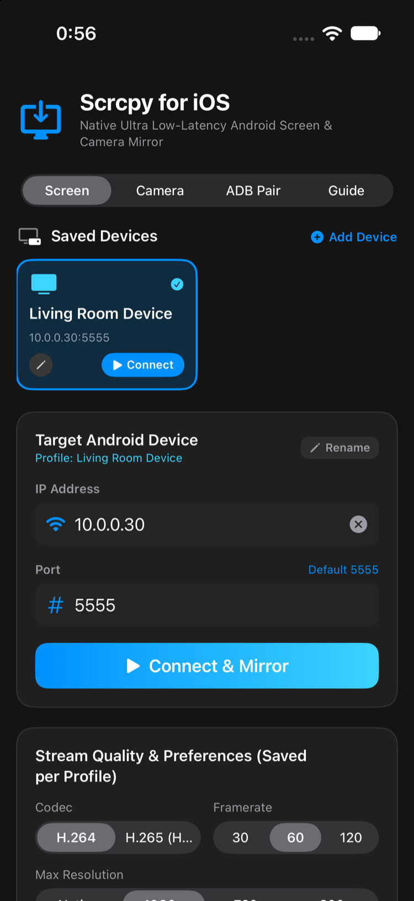
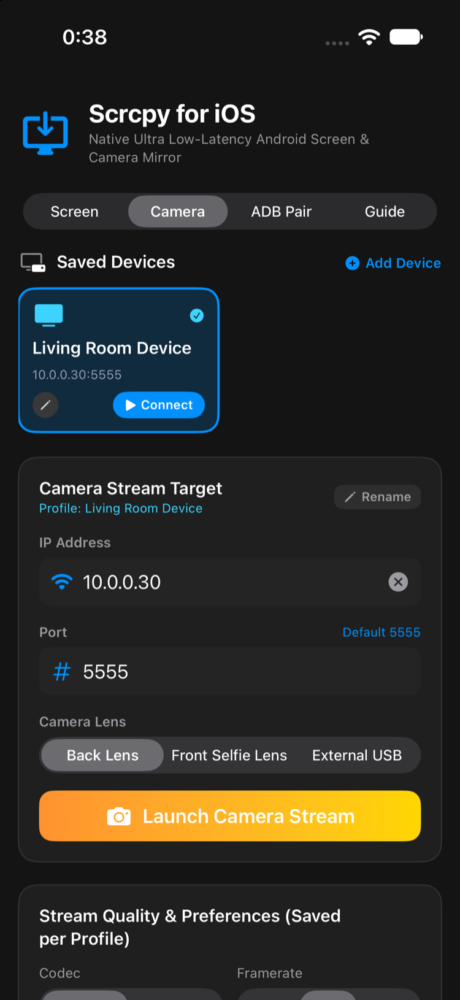
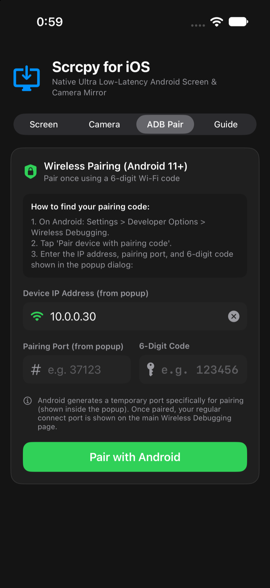
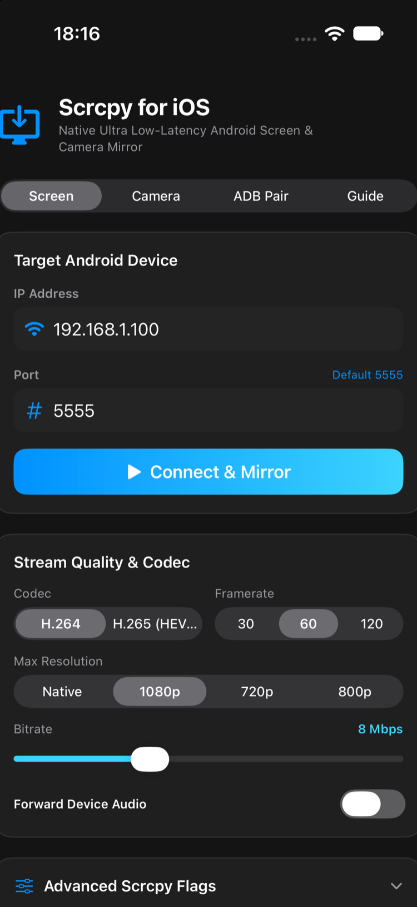
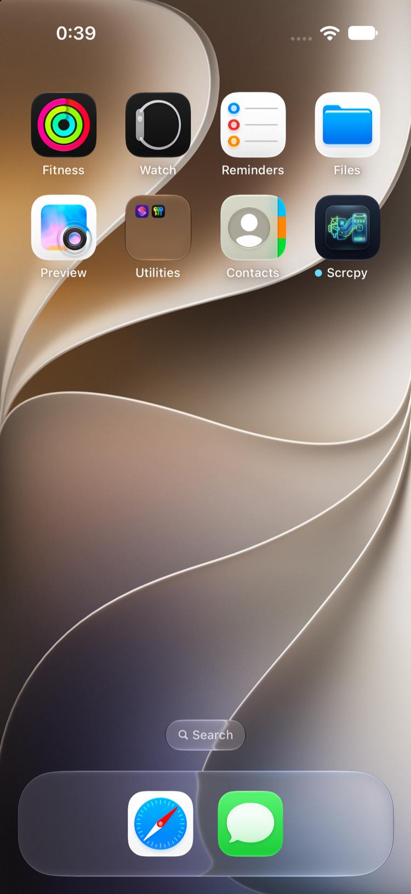

# Scrcpy for iOS (ScrcpyKit) 📱✨

A high-performance, native iOS/iPadOS client for **[scrcpy](https://github.com/Genymobile/scrcpy)** built entirely in pure Swift.

Stream and control your Android device directly from your iPhone or iPad over Wi-Fi with ultra-low latency, hardware-accelerated Apple VideoToolbox decoding, and full multi-touch support—no computer required.

---

## Screenshots

| Screen Mirroring | Camera Stream | Wireless ADB Pairing |
|:---:|:---:|:---:|
|  |  |  |

| Live Mirroring Session | Home Screen Icon |
|:---:|:---:|
|  |  |

---

## Key Highlights

- ⚡ **Ultra-Low Latency (< 20ms)**: Zero-copy direct hardware decoding into `AVSampleBufferDisplayLayer` via Apple Silicon Media Engine.
- 📱 **Pure Swift Architecture**: Built from scratch using modern Apple frameworks (`VideoToolbox`, `Network.framework`, `AVFoundation`, and `SwiftUI`). No external heavy dependencies like SDL or FFmpeg.
- 📶 **Autonomous Wireless Connection**: iPhone communicates directly with Android over TCP. Includes a built-in pure Swift ADB client supporting handshake, RSA-2048 authentication, server push, and multi-channel multiplexing.
- 🔑 **Built-in Android 11+ Wireless Pairing**: Pair once with a 6-digit code and pairing port directly from your iOS device without touching a terminal or PC.
- 📷 **Direct Android Camera Streaming**: Stream high-definition video from Android's **Back**, **Front Selfie**, or **External USB** camera lenses with microphone audio forwarding, zoom controls, and flashlight/torch toggle.
- 💾 **Device Profiles & Persistent Settings**: Automatically remembers all connected devices, lets you name them (e.g. "Living Room TV Box", "Pixel Fold"), and saves your preferred resolution, framerate, bitrate, codec, and audio choices across app launches.
- 👆 **Sub-Pixel Multi-Touch & Gestures**: Native iOS touch events mapped directly into Android touch coordinates with multi-finger drag, fling, and tap support.
- 🎮 **Dedicated Android Navigation Bar**: Back, Home, App Switcher / Recents, Power, Volume, and Screen Rotation controls, with a dedicated thumb-friendly dock in landscape mode.
- ⌨ **Live Text & Clipboard Sync**: Type into Android input fields directly using the iOS on-screen keyboard, with seamless bidirectional clipboard synchronization.

---

## Architecture Overview

```
┌────────────────────────────────────────────────────────────────────────┐
│                        Scrcpy for iOS (SwiftUI)                        │
│        (DeviceDiscoveryView, MirrorSessionView, ProfileManager)        │
└───────────────────────────────────┬────────────────────────────────────┘
                                    │
┌───────────────────────────────────▼────────────────────────────────────┐
│                              ScrcpyKit                                 │
│                                                                        │
│   ┌─────────────────────────────┐     ┌────────────────────────────┐   │
│   │        ScrcpyClient         │◄───►│     TouchOverlayView       │   │
│   │  (Connection Coordinator)   │     │ (Multi-touch & Gestures)   │   │
│   └──────────────┬──────────────┘     └─────────────┬──────────────┘   │
│                  │                                  │                  │
│   ┌──────────────┼──────────────────────────────────┤                  │
│   │              │                                  │                  │
│   ▼              ▼                                  ▼                  │
│ ┌──────────────┐ ┌──────────────┐     ┌────────────────────────────┐   │
│ │ VideoDecoder │ │ PcmAudioPlay │     │    ScrcpyControlMessage    │   │
│ │(VideoToolbox)│ │(AVAudioEngine│     │(Touch, Keys, Text, Clipbd) │   │
│ └──────┬───────┘ └──────┬───────┘     └─────────────┬──────────────┘   │
│        │                │                           │                  │
│   ┌────▼────────────────▼───────────────────────────▼──────────────┐   │
│   │                         AdbConnection                          │   │
│   │  (Pure Swift ADB: Handshake, RSA Auth, SYNC push, Multiplex)   │   │
│   └──────────────────────────────┬─────────────────────────────────┘   │
└──────────────────────────────────┼─────────────────────────────────────┘
                                   │ TCP (Wi-Fi: Port 5555)
                                   ▼
┌────────────────────────────────────────────────────────────────────────┐
│                            Android Device                              │
│       (/data/local/tmp/scrcpy-server.jar -> MediaCodec H.264/H.265)    │
└────────────────────────────────────────────────────────────────────────┘
```

---

## Features

- **Hardware Decoding**: Hardware H.264 and H.265 (HEVC) decoding using `VTDecompressionSession`.
- **Audio Forwarding**: Pure-Swift low-latency PCM audio playback (48kHz stereo) via `AVAudioEngine` and `AVAudioSourceNode` for both system audio (Android 11+) and camera microphone streams.
- **Customizable Video Parameters**:
  - Max Resolution: Native, 1080p, 720p, 800p
  - Bitrate: 2 Mbps up to 20 Mbps
  - Framerate: 30 FPS, 60 FPS, 120 FPS (iPhone & iPad ProMotion)
  - Video Codecs: H.264 or H.265 (HEVC)
- **Arbitrary Server Flags**: Support for custom scrcpy-server arguments like `crop=1080:1080:0:0`, `angle=90`, or `stay_awake=true`.
- **HUD Diagnostics**: Live framerate (FPS) counter, stream resolution, and connection status overlay.

---

## Quick Start: Connecting to an Android Device

### Option A: Standard Wi-Fi Connection (Port 5555)
1. On your Android device, enable **Developer Options** (tap *Build Number* 7 times in *Settings > About Phone*).
2. Go to **Settings > Developer Options** and enable **USB Debugging** (and **Wireless Debugging** if available).
3. If connecting for the first time via standard port 5555, enable TCP mode once:
   ```bash
   adb tcpip 5555
   ```
4. Note your Android device's local IP address (in **Settings > Wi-Fi**).
5. Open **Scrcpy** on your iPhone/iPad, enter the IP, and tap **Connect & Mirror**.
6. On Android, tap **Allow** on the prompt (*"Allow USB debugging from this computer?"*).

### Option B: Android 11+ Wireless Pairing (No PC Required)
1. On Android, open **Settings > Developer Options > Wireless Debugging**.
2. Tap **Pair device with pairing code**. A popup will show an IP address, pairing port, and 6-digit code.
3. Open **Scrcpy** on iOS, switch to the **ADB Pair** tab, and enter the details.
4. Tap **Pair with Android**. Once paired, return to the **Screen** or **Camera** tab and connect!

---

## Building and Running

### Requirements
- macOS with Xcode 15+ installed
- iOS 16.0+ deployment target

### Open in Xcode
1. Open the project in Xcode:
   ```bash
   open ScrcpyiOS.xcodeproj
   ```
   *(If you modify `project.yml`, regenerate the project using `xcodegen generate`)*.
2. Select the **ScrcpyApp** scheme and your target (iPhone, iPad, or iOS Simulator).
3. Press **Run** (`⌘R`).

### Sideloading (IPA)
A pre-packaged IPA is available in the `build/` directory:
- `build/Scrcpy.ipa`
Can be installed on real iOS devices using tools like TrollStore, AltStore, Sideloadly, or Apple Configurator.

### Run Automated Tests
```bash
swift run ScrcpyTests
```
Verifies ADB framing, RSA key generation, Android public key structuring, scrcpy protocol packets, touch coordinate serialization, and NALU conversions.

---

## Project Structure

```
├── project.yml                               # XcodeGen specification
├── ScrcpyiOS.xcodeproj                       # Native Xcode project
├── Package.swift                             # SwiftPM package configuration
├── Sources/
│   ├── ScrcpyKit/                            # Reusable Core Framework
│   │   ├── Adb/                              # Pure Swift ADB Client & Crypto
│   │   ├── Audio/                            # Low-latency PCM audio engine
│   │   ├── Protocol/                         # Scrcpy protocol packets & control messages
│   │   ├── Video/                            # Apple VideoToolbox hardware decoder
│   │   └── Session/                          # Session coordination & touch gestures
│   ├── ScrcpyApp/                            # iOS Application Target
│   │   ├── ScrcpyApp.swift                   # SwiftUI App entry point
│   │   ├── Models/                           # Device profile persistence
│   │   ├── Views/                            # Discovery, Camera, Pairing & Mirroring views
│   │   └── Resources/                        # Bundled scrcpy-server & AppIcon assets
│   └── ScrcpyTests/                          # Verification Test Runner
└── docs/screenshots/                         # App screenshots for documentation
```

---

## License
MIT License. `scrcpy-server` is Apache 2.0 (by Genymobile).
